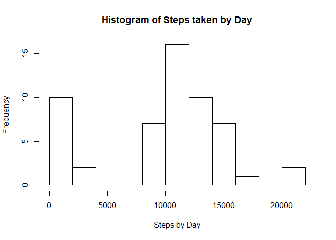
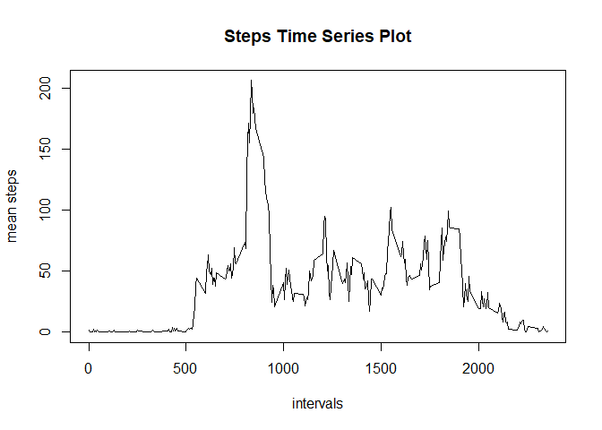
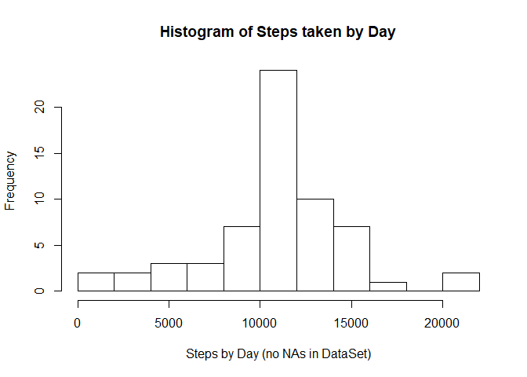
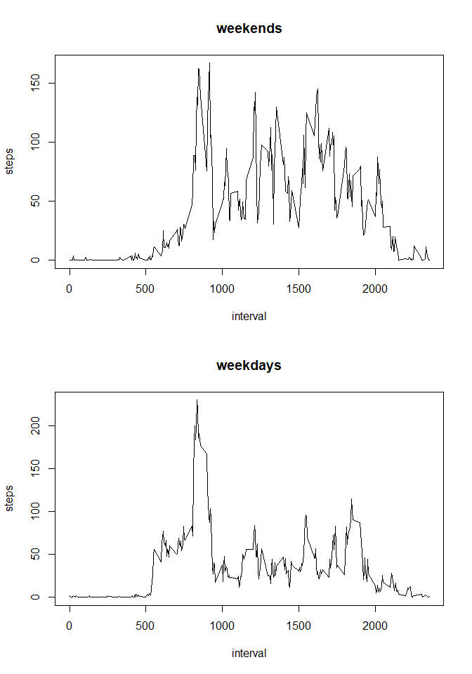

```r
#setwd("D:/git_repo/RepData_PeerAssessment1")
library(dplyr); library(lubridate); library(stringr); 
library(chron); library(ggplot2)
par(mfrow=c(1,1))
```
# Loading and preprocessing the data

```r
act <- read.csv("activity.csv", stringsAsFactors = FALSE)
act <- mutate(act,date =ymd(act$date)) 
```
# What is mean total number of steps taken per day?
* Calculate the total number of steps taken per day
* Make a histogram of the total number of steps taken each day
* Calculate and report the mean and median of the total number of steps taken per day

```r
steps_by_day <- act %>% group_by(date) %>% 
    summarize(tot = sum(steps, na.rm=T))
# there was no instruction to remove the days with 0 steps, so I left these days
# steps_by_day <- filter(steps_by_day, tot != 0)
hist(steps_by_day$tot, breaks = 10, 
     xlab="Steps by Day", main ="Histogram of Steps taken by Day")
```

<!-- -->

```r
mean_steps <- as.integer(mean(steps_by_day$tot))
median_steps <- as.integer(median(steps_by_day$tot))
```
The mean steps per day is **9354** and the
median steps per day is **10395**

# What is the average daily activity pattern?
* Make a time series plot (type="l") of the 5-minute interval (x-axis) and the average number of steps taken, averaged across all days (y-axis)
* Which 5-minute interval, on average across all the days in the dataset, contains the maximum number of steps?

```r
steps_by_int_mean <- act %>% group_by(interval) %>% 
    summarize(int_mean = mean(steps, na.rm=T))
with(steps_by_int_mean, plot(x=interval, y=int_mean, type="l", 
     xlab="intervals", ylab="mean steps", main="Steps Time Series Plot"))
```

<!-- -->

```r
max_int <- which.max(steps_by_int_mean$int_mean)
int_with_max_mean = steps_by_int_mean$interval[max_int]
max_mean = as.integer(steps_by_int_mean$int_mean[max_int])
```
The interval with max mean steps is the **835**, 
with **206** average steps

# Imputing missing values
* Calculate/report the total number of rows with NAs
* Devise a strategy for filling in all of the missing values in the dataset. 
* Create a new dataset with the missing data filled in.
* Make a histogram of the total number of steps taken each day
* Calculate and report the mean and median total number of steps taken per day. 
* Do these values differ from the estimates calculated before? 
* What is the impact of imputing missing data on the estimates of the total daily number of steps?

```r
steps_na <- is.na(act$steps)
number_nas <- sum(steps_na) 
```
Number of Rows with NAs: **2304**

```r
#Strategy for filling the NAs: Average of the steps in the same interval
#which it can be obtained from the Data Frame "steps_by_int_mean""

actx = mutate(act,
        hora=as.integer(substr(str_pad(as.character(interval),4,pad="0"),1,2)),
        minuto=as.integer(substr(str_pad(as.character(interval),4,pad="0"),3,4)),
        indice= (hora*12)+(minuto/5)+1)
for (i in 1:nrow(actx)) {
    if (is.na(actx$steps[i])) {
        j = actx$indice[i]
        actx$steps[i] <- steps_by_int_mean$int_mean[j]
    }
}
num_new_nas <- sum(is.na(actx$steps))
```
Strategy for filling the NAs: **Average of the steps in the same interval**

DataFrame **actx** created with all NAs filled with the average steps of that interval

Number of NAs on new DataFrame **actx: 0** 


```r
steps_by_day <- actx %>% group_by(date) %>% summarize(tot = sum(steps, na.rm=T))
hist(steps_by_day$tot, breaks = 10, xlab="Steps by Day (no NAs in DataSet)", 
     main ="Histogram of Steps taken by Day")
```

<!-- -->

```r
mean_steps2 <- as.integer(mean(steps_by_day$tot))
median_steps2 <- as.integer(median(steps_by_day$tot))
```
With no NAs, the mean steps per day is **10766** and the
median steps per day is **10766**

The mean increased from **9354** to **10766** and the median increased from **10395** to **10766**.

**There was an impact by filling the NAs.** By filling NAs with the steps average of the  same interval, the mean and median values increased.


# Are there differences in activity patterns between weekdays and weekends?
* Create a new factor with two levels ("weekday" & "weekend").
* Make a panel with the time series plot of weekdays & weekends (y-axis) and the 5-minute interval (x-axis) and the average number of steps. 

There was no instruction if the dataset to use was the one with NAs or the on without. I decided to use the one without the NAs replaced by the average of steps at the same interval.

```r
actx <- actx %>% mutate(flag = ifelse(is.weekend(actx$date),"weekend","weekday" )) %>%
      mutate(flag = as.factor(flag)) %>% select(steps, interval, flag) 

str(actx)
```

```
## 'data.frame':	17568 obs. of  3 variables:
##  $ steps   : num  1.717 0.3396 0.1321 0.1509 0.0755 ...
##  $ interval: int  0 5 10 15 20 25 30 35 40 45 ...
##  $ flag    : Factor w/ 2 levels "weekday","weekend": 1 1 1 1 1 1 1 1 1 1 ...
```
Factor **flag** created: levels: (weekend, weekday)

```r
par(mfrow=c(2,1))
steps_weekend <- actx %>% filter(flag == "weekend") %>% group_by(interval) %>% 
    summarize(steps = mean(steps))
with(steps_weekend, plot(x=interval, y=steps, type="l", main="weekends"))
steps_weekday <- actx %>% filter(flag == "weekday") %>% group_by(interval) %>% 
    summarize(steps = mean(steps))
with(steps_weekday, plot(x=interval, y=steps, type="l", main="weekdays"))
```

<!-- -->
